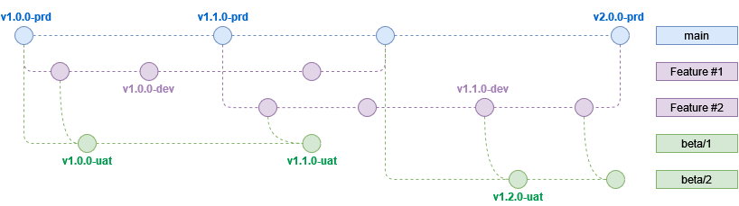

# Gitflow with TAG

## Basics
Before talking about the workflow, we have to clarify the relationship between branches & environments.

- main branch is the only reference branch, it is reflecting the state of production environment but should be deployable everywhere.
- beta branches are temporary branches created each week to make sure everyone is able to test in our beta environment. These branches are not mandatory, they merely compensate for the lack of duplicable env for acceptance testing.
- feature branches are based on main branch and used to develop new features, they should be deployable in both dev and beta environment

The philosophy behind this workflow is to give back flexibility and control of the deployment to the user. Each branch should be deployable without restraint on any testing environment (dev & beta).

Because of that, greater emphasis should be put in communicating with colleagues to ensure we are not overwriting their work unknowingly.

```diff
+ ℹ️ To keep our commit history clean on the **main** branch, **squash & merge must be enforced** for every PR with **1 feature = 1 commit** philosophy. It makes reverting broken changes much easier.
```

## Workflow
This is the workflow we want to apply to every repository:


## Rules 📜
- Every feature should be drawn from main in a dedicated branch. You can do as many commits as you want there. 

- Name of the feature branch should always be the Jira ticket number and a short description, ex feature/SEARCH-1315-my-feature

- For testing your work in dev, simply tag and push with the -dev suffix : 
```bash
# on your feature branch
git tag v1.0.0-dev
git push origin v1.0.0-dev
```
- For testing your work in beta, check if a beta branch exists for the current week and create it if not. 
`git branch beta/weekNumber`.
Merge your code in the beta branch of the week, tag and push with -uat suffix : 

```bash
git checkout beta/weekNumber
git merge feature/your-feature-branch
git tag v1.0.0-uat
git push origin v1.0.0-uat
```

```diff
! ⚠️ Be careful to not merge the **beta** branch into your feature branch, you do not want to bring the changes of others into your work.
! If any merge conflict happens, resolve it directly on the beta branch.
```

- If you’re ok with your work, open a PR to `main` from your feature branch. **Remember to always merge/rebase the main branch into your feature branch before opening a PR to solve all merge conflicts breforehand.** 
Ideally this PR should be open before the product team begins testing so any code improvement can be done beforehand. 

```diff
+ If your work is dependant on another feature which is not merged yet, mentioned it on the PR so tracking of dependencies is easier.
```

- If your work is validated by the product team and reviewed by the tech team, merge your PR into main (**squash & merge is enforced** by default and should always be used). 

## Deployment 🚀
Deployment is handled through the use of git tags. The format is following Gestion sémantique de version 2.0.0 (v{Major}.{Minor}.{Patch}). 


MAJOR version when you make incompatible API changes

MINOR version when you add functionality in a backward compatible manner

PATCH version when you make backward compatible bug fixes

The deploy pipeline is triggered as follow : 

- for dev → v*.*.*-dev
- for beta → v*.*.*-uat
- for prod → v*.*.*-prd

The *-prd tags are protected and may only be generated  from main branch by repo maintainers.

Example for deploying in dev : 

```bash
# Checkout your branch
git checkout feature/SEARCH-1315-jolie-branche
# tag your commit with an unused tag
git tag v1.0.0-dev
# 2 options for pushing : 
git push origin v1.0.0-dev
# or (will push all your tags even those not generated from this branch)
git push --tag
```

## OMG :scream:  I broke production
### Rollback procedure
If any regression happens in prod and we need to rollback changes, here is the procedure : 

Go to the `Actions` tab and search for the latest working production deployment (since we are using semver it should be the version before you). Click on the pipeline and select `Re-run all jobs` on the drop-down menu in the upper-right corner.


```diff
+ As long as the problem persist we SHOULD NOT push any changes into the main branch.
+ If the timeframe for fixing is too long, consider reverting the commit that caused the problem until a fix is available.
```

### Hotfixes 🚧
```diff
! ⚠️ Hotfixes are meant for urgent changes in production in case we break something. If the fix can wait, follow the standard push to prod procedure.
```
Hotfixes should be treated like regular features in term of testing and deployment to test env ( dev & beta). 

Create them in hotfix branch `git checkout -b hotfix/search-1450-my-hotfix` and tag them as [HOTFIX] when opening your PR to `main`.

To deploy them to production, contact one of the repo maintainers (PR needs to be merged).
