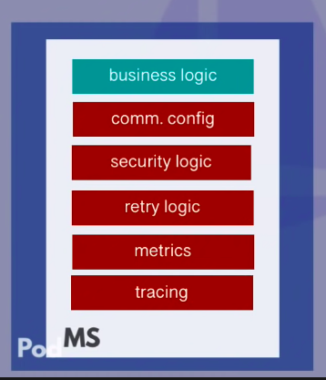
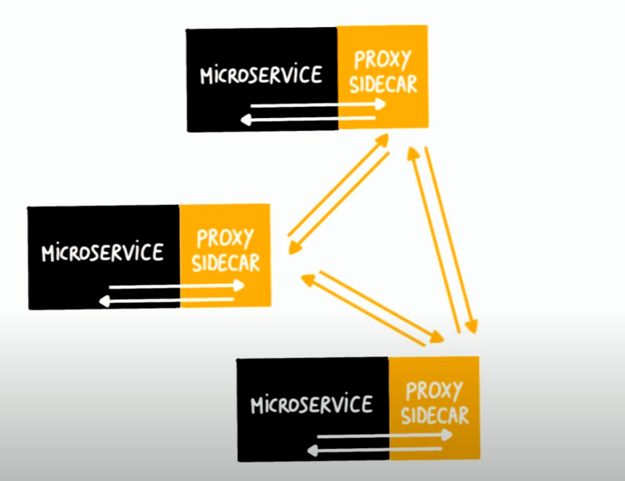

# ISTIO & Service Mesh

## Service Mesh (Maillage de Service)
### Context
One of the challenges of a **Microservice Architecture** is the **Communication** between each service. To do this, each service needs to know the endpoint of the other services. And usually, that information is considered as a part of the application or the code.

For example, we now deploy our microservices on a cluster. From *Security* perspective, we normally have a firewall rules to handle the incoming requests, so the requests cannot access directly to the cluster. However, once request gets inside the cluster, the communication is **insecure**.
- Microservices talk to each other over http or some other insecure protocol
- Services talk to each other freely -> no restrictions
    - Every service inside the cluster can talk to any other service

In short, the drawbacks are
- The **NON business logic** must be added to each application
- Developers don't work on actual service/application logic
- More complexity of the services

### Solution: Service Mesh
**Service Mesh** helps us to extract all the non-business logic out of the microservices using a thing called **Sidecar** which
- handles these networking logic
- acts as a Proxy
- is a third-party application
    - that the cluster can easily configure through a simple API without worrying about how the logic is implemented

Each service will be attached with a **Sidecar proxy** that handles all incoming and outgoing requests. And together, these **Sidecar proxies** form a mesh of service. 

In fact, we don't have to add this **Sidecar proxy** configuration to our microservice's deployment yaml file because the **Service Mesh** has a **Control Plan**  (Brique Centrale) that will automatically inject this proxy in every microservice.

