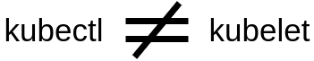
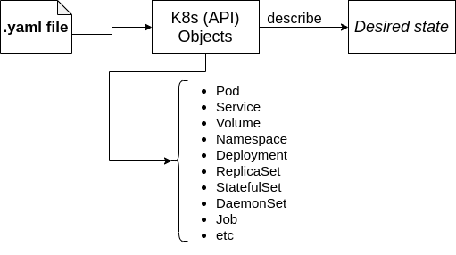
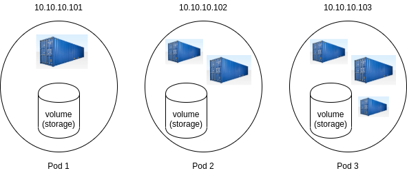
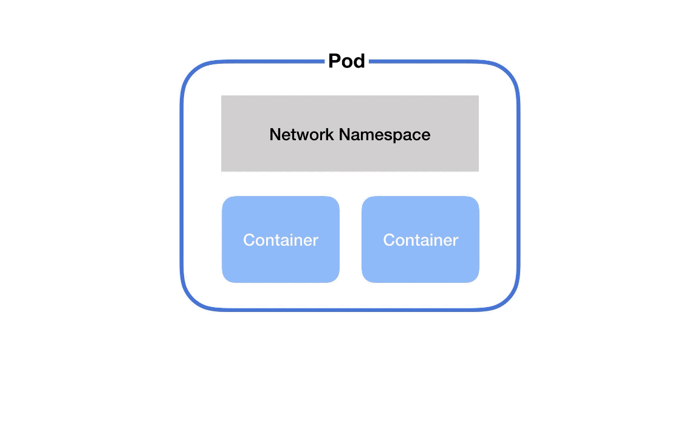
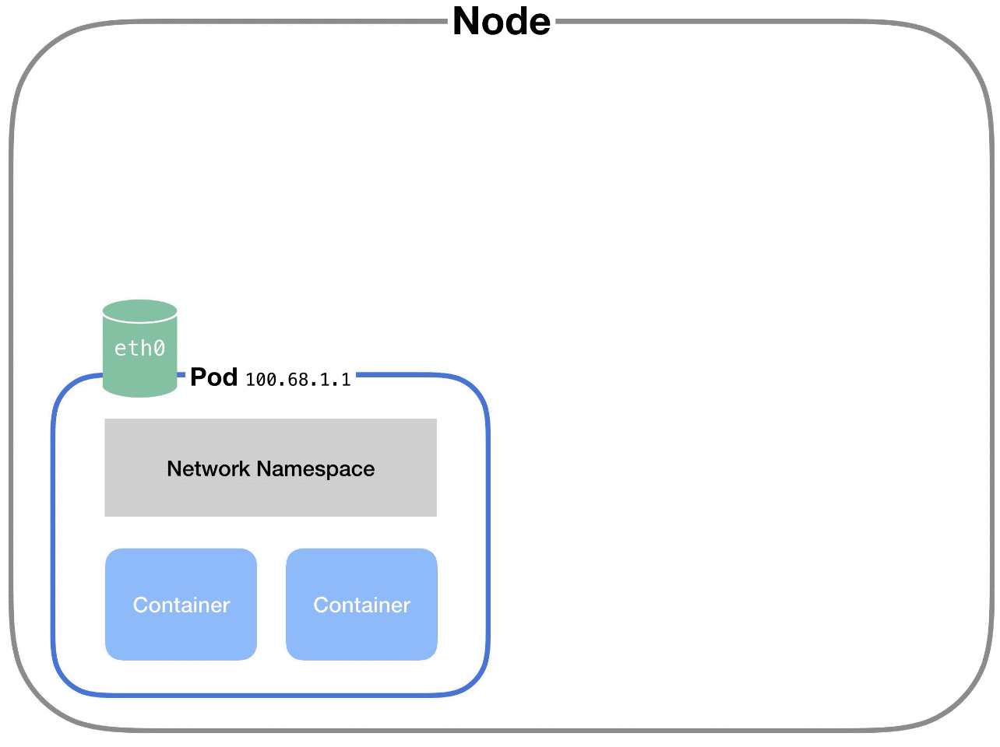
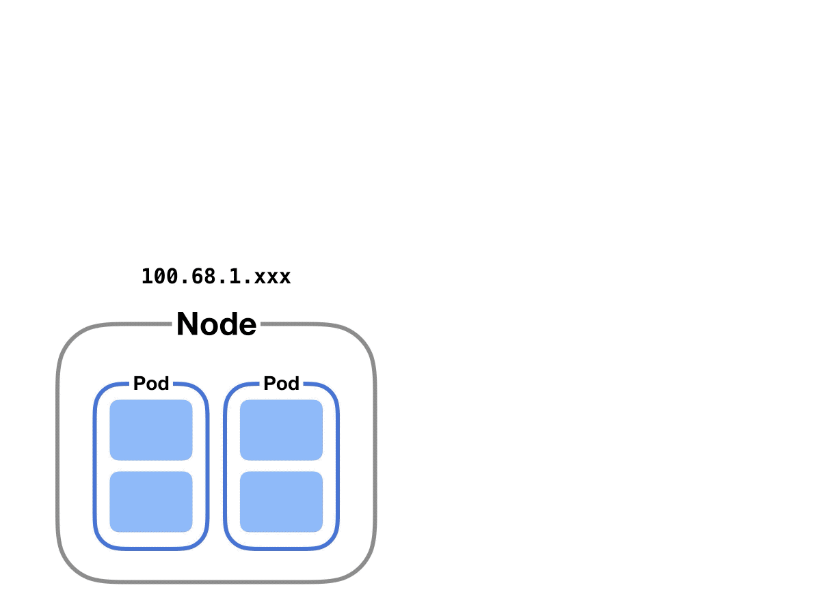
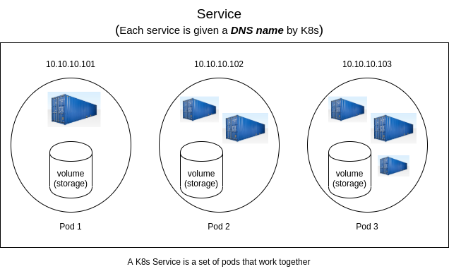
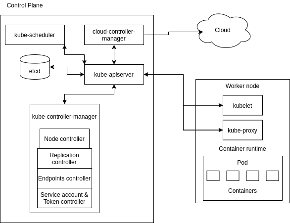

# Kubernetes - K8s

# Why we need K8s
When a microservice application is deployed in production, it usually has many running containers that need to be allocated the right amount of resources in response to user demands. Also, there is need to ensure that the containers are online, running and communicating with one another. The need to efficiently manage and coordinate clusters of containerized applications gave riseto K8s.

K8s is a software system that addresses the concerns of **deploying, scaling and monitoring containers**. Hence, it is called a ```container orchestrator```. Examples of other container orchestrators are Docker Swarn, Mesos Marathon and Hashicorp Nomad.

# Options to use/install Kubernetes
- Online K8s Labs
    - Kubernetes Playground
    - Play with K8s
    - Play with Kubernetes Classroom
- Kubernetes installation tools
    - Minikube
    - Kubeadm
- Cloud based Kubernetes services
    - GKE - Google Kubernetes Engine
    - AKS - Azure Kubernetes Engine
    - Amazon EKS

# Features of K8s
- Automation bin packing
    - K8s will take care of packaging the jobs (containers) in bins (servers) in the most efficient way and schedule the container based on the requirements and resource available.

- Horizontal auto-scaling
    - Scale up: create more replicas of container if required
    - Scale down: kill the containers in case the containers are not required

- Self-healing
    - if container fails => restarts container
    - if node dies => replaces & reschedule containers on other nodes
    - if container does not respond to user defined health check => kills container
    
        => The process that take care of all this in K8s is called **Replication Controller**.

- (DNS) Service discovery & Load balancing
    - With the process of providing the *unique IP* to each **Pod** and the *DNS name* to the **Service**, K8s can take control over the network and communication between **Pod** and also do a load balancing in these **Pods**

- Storage orchestration
    - K8s provides us an option to select the volume storage resource, so it can be your local storage or a cloud storage like AWS, GCP or a network storage like NFS (all options are available)

- Automated Rollouts & Rollbacks
    - Rollout: deploy changes to the application or its configuration
    - Rollback: revert the changes & restore to previous state

        => To ensure there are **no downtime during the process**, K8s progressively rolls out changes to your application or its configuration, while monitoring application health to ensure it doesn’t kill all your instances at the same time. If something goes wrong, K8s will rollback the change for you. 

- Batch execution
    - Batch jobs require an executable/process to be run to completion. 
    - In K8s, **run to completion jobs** are primarily used for batch processing. 
    - Each job creates one or more **Pods**. 
    - During job execution, if any container or **Pods** fails, **Job Controller** will reschedule the container, **Pods** on another node. 
    - Can run multiple **Pods** in parallel and can scale up if required. As job is completed, the **Pods** will move from running state to shut down state.



# Work with K8s
To work with Kubernetes, you use ```Kubernetes API objects``` to describe your cluster’s ***desired state*** : what applications or other workloads you want to run, what container images they use, the number of replicas, what network and disk resources you want to make available, and more.



In the image above, for example, we can passing the ```.yaml file``` as an argument of ```kubectl apply``` command to create K8s object. And most often, you provide the information to ```kubectl``` in a ```.yaml file```.

In fact, we can use either ```kubectl``` or [**Client Libraries**](https://kubernetes.io/docs/reference/using-api/client-libraries/) to make the necessary Kubernetes API calls to create K8s objects. 

To display all K8s objects
```
$ kubectl api-resources
```

# Concepts
## Pod(s)
In fact, K8s doesn't run containers directly, instead, it wraps one or more containers into a higher-level struture called **Pod**.

A Pod contains:
- an application container (or, in some cases, multiple containers)
- storage resource (or volume), usually there is single volume for all the containers inside the pod 
- **a unique IP address**



### Communication between containers in Pod
In K8s, two containers running in the same **Pod** talk to each other via `localhost` and **port number**. This is because each **Pod** has its own **Network Namespace** so containers in the same **Pod** are in the same **Network Namespace** - they share network resources.



We need also to watch out for *port conflicts* when we've got multiple containers in the same **Pod**.

In fact, there's a secret container, called `pause` container, that runs on every **Pod** to keep the namespace open in case all the other containers on the **Pod** die.

### Communication between Pods on the same Node

We know that each **Pod** has its own **Network Namespace** and **a unique IP address**. Besides that, K8s also creates (fakes) a virtual ethernet connection `eth0` to make network requests through. In fact, each `eth0` connects to the Node via a tunnel, called virtual ethernet device. This connection has two sides – on the pod’s side, it’s named `eth0`, and on the node’s side, it’s named `vethX` (there’s a `vethX` connection for every **Pod** on the Node: `veth1`, `veth2`, `veth3`, etc).



To communicate between **Pods**, K8s uses a **Network Bridge**, called `cbr0`. When a request hits the bridge, the bridge asks all the connected **Pods** if they have the right IP address to handle the original request. If one of the **Pods** does, the bridge will store this information and also forward data to the original back so that its network request is completed.

Every pod on a node is part of the bridge, and the bridge connects all pods on the same node together.

### Communication between Pods on different Nodes

When the **Network Bridge** asks all the connected **Pods** if they have the right IP address and none of them say yes, then, this goes up to the Cluster level and looks for the IP address.



At the cluster level, there’s a `table` that maps IP address ranges to various Nodes. 

For example: K8s might give 
- **Pods** on Node 1 addresses like 100.96.1.1, 100.96.1.2, etc
        
    => `table` store IP address like 100.96.1.xxx for Node 1  
- **Pods** on Node 2 addresses like 100.96.2.1, 100.96.2.2, etc.
    
    => `table` store IP address like 100.96.2.xxx for Node 2


## Service
In Kubernetes, a **Service** is an abstraction which defines a logical set of Pods and a policy by which to access them.



### Communication between Pods and Services

This happens via `kube-proxy`.

## Replication Controller
This object (`rc` for short) ensures that a specified number of **Pod** replicas are running at any one time. 

- If there are too many **Pods** => `rc` terminates the extra **Pods**
- If there are too few => `rc` starts more **Pods**
- If **Pods** fail, are deleted, or are terminated => `rc` automatically replace

In fact, `rc` is kind of *OLD*, and is replaced by **ReplicaSet**, the next generation. The difference is:
- `rc` supports *equality-based selector*
- **ReplicaSet** supports *set-based selector*

## ReplicaSet
The **ReplicaSet**'s purpose is ensure a specified number of **Pods** are running at any time.

The **ReplicaSet** and **Pods** are associated with `labels`.

## Labels & Selectors
- `labels` are key/value pairs that are attached to objects, such as **Pods**.

- `selectors` helps us identify a set of objects. 

Now we take a look at `matchLabels` in `selectors`:

|||
|-----|-----|
|...<br>&emsp;selector:<br>&emsp;&emsp;app: nginx<br>&emsp;&emsp;tier: frontend<br>&emsp;...|...<br>&emsp;selector:<br>&emsp;&emsp;`matchLabels`:<br>&emsp;&emsp;&emsp;app: nginx<br>&emsp;&emsp;&emsp;tier: frontend<br>&emsp;...|
|Use in **Replication Controller**, **Services**| Use in **ReplicaSet**, **Deployment**, **Job**, **DaemonSet**|

The K8s currently supports two types of `selectors`: *equality-based* and *set-based*.

| Equality-based  | Set-based |
| ------------- | ------------- |
| Operations:<br>&emsp;= == !=  | Operations:<br>&emsp;in notin exists  |
|   Examples: <br>&emsp;# Get all Pods who their environment are production<br>&emsp; environment = production<br>&emsp;# Get all Pods who their tier are not frontend<br>&emsp; tier != frontend  | Examples:<br>&emsp;# Get all Pods who their environment are production OR qa<br>&emsp; environment in (production, qa)<br>&emsp;# Get all Pods who their tier are not frontend AND backend<br>&emsp; tier notin (frontend, backend)  |
|Use along with kubectl:<br>&emsp;`$ kubectl get pods -l environment=production`|Use along with kubectl:<br>&emsp;`$ kubectl get pods -l environment in (production)`|
|In Manifest (yaml) file:<br>&emsp;...<br>&emsp;`selector`:<br>&emsp;&emsp;environment: production<br>&emsp;&emsp;tier: frontend<br>&emsp;...|In Manifest (yaml) file:<br>&emsp;...<br>&emsp;`selector`:<br>&emsp;&emsp;`matchExpressions`:<br>&emsp;&emsp;&emsp;- {key: `tier`, operator: `In`, values: [`cache`]}<br>&emsp;&emsp;&emsp;- {key: `environment`, operator: `NotIn`, values: [`dev`,`qa`]}<br>&emsp;...|
|Support by:<br>&emsp; **Services**, **Replication Controller**| Support by:<br>&emsp; **Job**, **Deployment**, **ReplicaSet**, **DaemonSet**|

:information_source: we use `matchLabels` when we have key with **one** value. In case there are **a set** of value to select from, we use `matchExpressions`. 


# Architecture of K8s



The main components of K8s engine are:
- Master Node
    - run on single node
    - responsible for managing the cluster: monitor nodes & **Pods** in a cluster
    - 5 components:
        - kube-apiserver
        - kube-controller-manager
        - cloud-controller-manager
        - kube-scheduler
        - etcd

- Worker Node (or just Node)
    - kubelet
    - kube-proxy

## Master Node Components
### kube-apiserver
In K8s world, the `kube-apiserver` is responsible for all the communication. The `kube-apiserver` exposes some APIs, for almost every operation, so that the users can interact. And to use (call) these APIs, we can use the command-line tools (like `kubectl`) or from a UI.

### kube-scheduler
The `kube-scheduler` is a component that schedules **Pods** across multiple nodes. We know that in K8s, Worker Nodes can be a physical or virtual machines and they can have different infrastructure or hardware configuration. In fact, the `kube-scheduler` knows about these informations and whenever it has to schedule **Pod(s)**, it will check what node will fit best for the configuration or hardware requirements of the **Pod(s)**.

### kube-controller-manager
The `kube-control-manager` runs watch-loops continuously to compare cluster's desired state to its current state (obtained from `etcd` data store via the `kube-apiserver`). In case of a mismatch, corrective action is taken in the cluster until its current state matches the desire state.

The `kube-control-mangager` includes:
- Node controller
- Replication controller
- Endpoints controller
- Service Account & Token controller

***Note***: each controller is separate process, but to reduce complexity, they are all compiled into a single binary and run in a single process.


### cloud-controller-manager
When we are using the infrastructure of a Cloud Provider, all monitors that need to run for interacting with Cloud Service Provider of this infrastructure is done through `cloud-controller-manager`.

The `cloud-controller-manager` includes:
- Node controller
- Route controller
- Service controller

### etcd
- Open source, distributed key-value database from CoreOS
- Single source of truth for all components of the K8s cluster

***Note***: Only the `kube-apiserver` is the component that can directly interact with the `etcd` data store. There is **no** other component that can interact with `etcd` directly.

## Worker Node Components

These components run on every node, maintaining running **Pod(s)** and providing the K8s runtime environment. 

### kubelet
The `kubelet` is the component that interacts with the Master Node via the `kube-apiserver`. Technically, the `kubelet` gets the informations from some **specs** called `PodSpecs` and based on those specifications, it makes sure the containers are running accordingly on the **Pod(s)**. In case there is any issue with any **Pod(s)**, it will try to restart the **Pod(s)** on the same node or if required, it will start the **Pod(s)** on a different node.

***Note***: `kubelet` only manages the containers which are created by the K8s. In case you have the containers running on the node or the machine which were not create by K8s, `kubelet` will not manage those containers.

### kube-proxy
The `kube-proxy` is the core networking component in a node, it maintains the network configuration and can also interact with the external world.

***Note***: `kube-proxy` watches the `kube-apiserver` on the Master Node for the addition and removal of **Service(s)** and endpoint(s).

### Container runtime
This is responsible for running containers


# References
[1] https://kubernetes.io/docs/concepts/

[2] https://matthewpalmer.net/kubernetes-app-developer/articles/kubernetes-networking-guide-beginners.html

