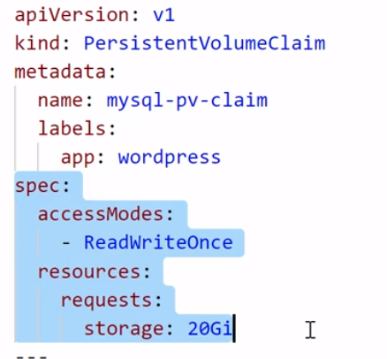

# Kubernetes - K8s

Summary
- [Why we need K8s](#-1.-Why-we-need-K8s)
- [Options to use/install Kubernetes](#-2.-Options-to-use/install-Kubernetes)
- [Features of K8s](#-3.-Features-of-K8s)
- [Work with K8s](#-4.-Work-with-K8s)
- [Concepts](#-5.-Concepts)
    - [Pod(s)](##-5.1-Pod(s))
        - [Communication between containers in Pod](###-5.1.1-Communication-between-containers-in-Pod)
        - [Communication between Pods on the same Node](###-5.1.2-Communication-between-Pods-on-the-same-Node)
        - [Communication between Pods on different Nodes](###-5.1.3-Communication-between-Pods-on-different-Nodes)
    - [Service](##-5.2-Service)
        - [Types of Services](###-5.2.1-Types-of-Services)
            - [ClusterIP [Default]](####-5.2.1.1-ClusterIP-[Default])
            - [NodePort](####-5.2.1.2-NodePort)
            - [LoadBalancer](####-5.2.1.3-LoadBalancer)
        - [Communication between Pods and Services](###-5.2.2-Communication-between-Pods-and-Services)
    - [ConfigMap](##-5.3-ConfigMap)
    - [Secrets](##-5.4-Secrets)
    - [(Storage) Volumes](##-5.5-(Storage)-Volumes)
        - [PersistentVolumeClaim & Persistent Volumes & StorageClass](###-5.5.1-PersistentVolumeClaim-&-Persistent-Volumes-&-StorageClass)
        - [Types of Volumes](###-5.5.2-Types-of-Volumes)
    - [Deployment](##-5.6-Deployment)
        - [Features](###-5.6.1-Features)
        - [Types](###-5.6.2-Types)
    - [StatefulSet](##-5.7-StatefulSet)
    - [Replication Controller](##-5.8-Replication-Controller)
    - [ReplicaSet](##-5.9-ReplicaSet)
    - [Labels & Selectors](##-5.10-Labels-&-Selectors)
    - [DaemonSet](##-5.11-DaemonSet)
    - [Job(s)](##-5.12-Jobs)
    - [Namespaces](##-5.13-Namespaces)
        - [Need of **Namespace**](###-5.13.1-Need-of-Namespace)
        - [Characteristics](###-5.13.2-Characteristics)
- [Architecture of K8s](#-6.-Architecture-of-K8s)
    - [Master Node Components](##-6.1-Master-Node-Components)
        - [kube-apiserver](###-6.1.1-kube-apiserver)
        - [kube-scheduler](###-6.1.2-kube-scheduler)
        - [kube-controller-manager](###-6.1.3-kube-controller-manager)
        - [cloud-controller-manager](###-6.1.4-cloud-controller-manager)
        - [etcd](###-6.1.5-etcd)
    - [Worker Node Components](##-6.2-Worker-Node-Components)
        - [kubelet](###-6.2.1-kubelet)
        - [kube-proxy](###-6.2.2-kube-proxy)
        - [Container runtime](###-6.2.3-Container-runtime)
- [References](#-7.-References)

# 1 Why we need K8s
When a microservice application is deployed in production, it usually has many running containers that need to be allocated the right amount of resources in response to user demands. Also, there is need to ensure that the containers are online, running and communicating with one another. The need to efficiently manage and coordinate clusters of containerized applications gave riseto K8s.

K8s is a software system that addresses the concerns of **deploying, scaling and monitoring containers**. Hence, it is called a ```container orchestrator```. Examples of other container orchestrators are Docker Swarn, Mesos Marathon and Hashicorp Nomad.

# 2. Options to use/install Kubernetes
- Online K8s Labs
    - Kubernetes Playground
    - Play with K8s
    - Play with Kubernetes Classroom
- Kubernetes installation tools
    - Minikube
    - Kubeadm
- Cloud based Kubernetes services
    - GKE - Google Kubernetes Engine
    - AKS - Azure Kubernetes Engine
    - Amazon EKS

# 3. Features of K8s
- Automation bin packing
    - K8s will take care of packaging the jobs (containers) in bins (servers) in the most efficient way and schedule the container based on the requirements and resource available.

- Horizontal auto-scaling
    - Scale up: create more replicas of container if required
    - Scale down: kill the containers in case the containers are not required

- Self-healing
    - if container fails => restarts container
    - if node dies => replaces & reschedule containers on other nodes
    - if container does not respond to user defined health check => kills container
    
        => The process that take care of all this in K8s is called **Replication Controller**.

- (DNS) Service discovery & Load balancing
    - With the process of providing the *unique IP* to each **Pod** and the *DNS name* to the **Service**, K8s can take control over the network and communication between **Pod** and also do a load balancing in these **Pods**

- Storage orchestration
    - K8s provides us an option to select the volume storage resource, so it can be your local storage or a cloud storage like AWS, GCP or a network storage like NFS (all options are available)

- Automated Rollouts & Rollbacks
    - Rollout: deploy changes to the application or its configuration
    - Rollback: revert the changes & restore to previous state

        => To ensure there are **no downtime during the process**, K8s progressively rolls out changes to your application or its configuration, while monitoring application health to ensure it doesn’t kill all your instances at the same time. If something goes wrong, K8s will rollback the change for you. 

- Batch execution
    - Batch jobs require an executable/process to be run to completion. 
    - In K8s, **run to completion jobs** are primarily used for batch processing. 
    - Each job creates one or more **Pods**. 
    - During job execution, if any container or **Pods** fails, **Job Controller** will reschedule the container, **Pods** on another node. 
    - Can run multiple **Pods** in parallel and can scale up if required. As job is completed, the **Pods** will move from running state to shut down state.


# 4. Work with K8s
To work with Kubernetes, you use ```Kubernetes API objects``` to describe your cluster’s ***desired state*** : what applications or other workloads you want to run, what container images they use, the number of replicas, what network and disk resources you want to make available, and more.


In the image above, for example, we can passing the ```.yaml file``` as an argument of ```kubectl apply``` command to create K8s object. And most often, you provide the information to ```kubectl``` in a ```.yaml file```.

In fact, we can use either ```kubectl``` or [**Client Libraries**](https://kubernetes.io/docs/reference/using-api/client-libraries/) to make the necessary Kubernetes API calls to create K8s objects. 

To display all K8s objects
```
$ kubectl api-resources
```

# 5. Concepts
## 5.1 Pod(s)
In fact, K8s doesn't run containers directly, instead, it wraps one or more containers into a higher-level struture called **Pod**.

A Pod contains:
- an application container (or, in some cases, multiple containers)
- storage resource (or volume), usually there is single volume for all the containers inside the pod 
- **a unique IP address**
    - new IP address on **re**-creation


### 5.1.1 Communication between containers in Pod
In K8s, two containers running in the same **Pod** talk to each other via `localhost` and **port number**. This is because each **Pod** has its own **Network Namespace** so containers in the same **Pod** are in the same **Network Namespace** - they share network resources.


We need also to watch out for *port conflicts* when we've got multiple containers in the same **Pod**.

In fact, there's a secret container, called `pause` container, that runs on every **Pod** to keep the namespace open in case all the other containers on the **Pod** die.

### 5.1.2 Communication between Pods on the same Node

We know that each **Pod** has its own **Network Namespace** and **a unique IP address**. Besides that, K8s also creates (fakes) a virtual ethernet connection `eth0` to make network requests through. In fact, each `eth0` connects to the Node via a tunnel, called virtual ethernet device. This connection has two sides – on the pod’s side, it’s named `eth0`, and on the node’s side, it’s named `vethX` (there’s a `vethX` connection for every **Pod** on the Node: `veth1`, `veth2`, `veth3`, etc).


To communicate between **Pods**, K8s uses a **Network Bridge**, called `cbr0`. When a request hits the bridge, the bridge asks all the connected **Pods** if they have the right IP address to handle the original request. If one of the **Pods** does, the bridge will store this information and also forward data to the original back so that its network request is completed.

Every pod on a node is part of the bridge, and the bridge connects all pods on the same node together.

### 5.1.3 Communication between Pods on different Nodes

When the **Network Bridge** `cbr0` asks all the connected **Pods** if they have the right IP address and none of them say yes, then, this goes up to the Cluster level and looks for the IP address.


At the cluster level, there’s a `table` that maps IP address ranges to various Nodes. 

For example: K8s might give 
- **Pods** on Node 1 addresses like 100.96.1.1, 100.96.1.2, etc
        
    => `table` store IP address like 100.96.1.xxx for Node 1  
- **Pods** on Node 2 addresses like 100.96.2.1, 100.96.2.2, etc.
    
    => `table` store IP address like 100.96.2.xxx for Node 2


## 5.2 Service
Imagine that, you have been asked to deploy web app
- How does this front-end web app is exposed to outside world?
- How do front-end web app connected to backend database?
- **Pods** do die, when they die, it get recreated if the Controller is supporting, but when they recreated, their IP changes, so it will be difficult to connect and communicate when IP changes dynamically, how do we resolve this problem?


In Kubernetes, a **Service** is an abstraction 
- defines a logical set of **Pod(s)** 
    - but lifecycle of **Pod(s)** and **Service** NOT connected
- defines a policy by which to access them 
- provides some of the **important features**, that are standardized across the cluster, such as 
    - load-balancing
    - service discovery between apps
    - supporting zero downtime app deployments


:key: each **Service** has its own DNS name or its own IP addresse. Name and IP addresse of **Service** are stable. The name and IP gets registered with the cluster's built-in **DNS**, or add-on **DNS**.

:information_source: The **Domain Name System (DNS)** is a system for associating various types of information – such as IP addresses – with easy-to-remember names. Every cluster can have a native DNS Service (we might have to manually start it) and every **Pod** in a cluster knows how to use it.

Using `selectors`, a **Service** will select the **Pods**' `labels` to get its respective **Pods**.

When we create a **Service** object 
- with the label selector
    - K8s also creates another object called **Endpoint** object
        - list of **Pods** IPs and ports that match the label selector
        - always up-to-date if **Pods** are added or removed
        - has the same name with the **Service** object it's associated with
    - for ex
    
- without the label selector
    - we must create **Endpoint** object if we want to use


### 5.2.1 Types of Services
#### 5.2.1.1 ClusterIP [Default]
It is reachable only from **within** the cluster: it gives us a **Service** inside our cluster that other apps inside our cluster can access (for example: we don't want to expose our database to the outside world, in such case, **Service** type ClusterIP is a good option). There is *no external access*.

#### 5.2.1.2 NodePort
**NodePort**, superset of **ClusterIP**, opens **a** specific **port on all** the Nodes of our cluster (in case if we don't mention **NodePort** specifically in the manifest file, then K8s will assign unused **NodePort** dynamically). It makes a **Service** accessible from the outside world using `NodeIP:NodePort` or `ClusterIP:XXYYZZ`.

:book: For example

We could use either `NodeIP:30001` or `10.15.244.182:8080` to access. In fact, `hello-svc:8080` also works!!!


Now, we will find out the difference **Port Types** that we can use, look at the picture below


Here we have:
- `nodePort` 
    - this port with Node IP make the **Service** visible *outside* the cluster
- `port` 
    - the port of **Service** itself, it make **Service** will be reachable via this port
    - any request reaching there is forwarded to a running **Pod** on `targetPort`
- `targetPort`: 
    - this is the port on actually **Pod** where the app is running. If it is not specified , the `targetPort` and `port` will be the same by default

We have some **scenarios** as following
- Multi instances in same Node
    - 
    - here, we simply use 100.96.1.xxx:31000, for this example, to access

- Multi instances in difference Node
    - 
    - here, we can use any combination `NodeIP:NodePort` to access


However, there are some **downsides** when using this type:
- only one **Service** per port
- only use ports 30000 – 32767
- If the Node IP address changes, we need to deal with that

:warning: For these reasons, people don’t recommend using this method in production to directly expose our apps. If we are running a app that doesn’t have to be always available, or we are very cost sensitive, this method will work. A good example of such an application is a demo app or something temporary.

#### 5.2.1.3 LoadBalancer
In [the Multi instances in difference Node](####NodePort) scenario of **NodePort** where we have a multiple instances of **Pods** that are deployed on multiple Nodes. The problem with this setup here is to access this app, we can use any of the public IP of the Node and the `NodePort`, so:
- Which `NodeIP` will we provide to the end-users? 
- Are they comfortable to use IP and port number to access the app?
- How is the traffic balanced equally among all Nodes inside the cluster?

=> That's where **LoadBalancer** comes into the pictures


This type, superset of **NodePort**, is the standard way to expose a **Service** to the internet, by using the load balancer of the current cloud provider (like *Network Load Balancer of GKE*) or creating an external load balancer in the current cloud (if supported). Both ways will give us a **single IP address** (for one **Service**) that will forward all traffic to our **Service**. In this figure above, we need to configure the DNS server to point to this IP address, so the end-users can access the app using the URL [myapp.com]().

:book: For example

Taping `35.228.74.4:8080` in browser, we could access the application. 

:warning: In reality, in the cloud like GCP or AWS, the **LoadBalancer** is not cheap, every time we create a **Service** of type **LoadBalancer**, it will cost us dollars.

### 5.2.2 Communication between Pods and Services

This happens via `kube-proxy`.

## 5.3 ConfigMap
Imagine that we have a **Pod** `my-app` and a **Pod** `DB`. And they work together to create our application. To do that, `my-app` need a database endpoint, let's say `mongo-db-service` which is used to communicate with the database. And usually, this database url or endpoint is configured in `my-app` (like in properties file for ex). That means, the database url is usually inside of the build image of our application. And that causes a problem: if the endpoint changed to, for ex: `mongo-db`, we would have to adjust that url in the application, rebuild the application with the new version, push it to the repo, pull it in our **Pod**, etc. And K8s helps us to solve that by using **ConfigMap**. 

A **ConfigMap**, a dictionary of configuration settings, allows us to decouple environment-specific configuration from **Pods**/containers, which means it keeps our application code separate from our configuration (like database url for ex). So this lets us change easily configuration depending on the environment (development, production, testing).

:warning: We must create a **ConfigMap** before referencing it in a **Pod** `spec` (in yaml file).

We can create a **ConfigMap** from:
- directories
    - where they contain the configurations files
- file
- literal key-value pairs defined on the command line (`--from-literal`) 

Now, where do we place the **ConfigMap** inside the **Pod**, so there are two different ways:
- mounting it as a **Volume**
- via environment variables (use `envFrom` in **Pod**'s yaml file)

## 5.4 Secrets
- like **ConfigMap** but let us store and manage *sensitive information*, such as passwords, OAuth tokens, and ssh keys. 
- are created outside of **Pods** and stored along with other configurations inside `etcd` database on K8s Master
- no more than 1MB
- are sent only to the target Nodes where the **Pods** demand it, unlike the **ConfigMap** who is broadcasted.

To use a **Secret**, a **Pod** needs to reference the **Secret**, there are two ways
- As files in a **Volume** mounted
    - :warning: Look at this example
    
    We have two **Secrets** that were mounted into the **Pod** but each `volumeMounts->mountPath` must be **unique**. In this example, if you apply this file, K8s will throw you an error `'Invalid value: "/var/secret": must be unique` during pod validation step.
    - To have two or more **Secrets** in the same directory, we could use [Projected Volume](https://kubernetes.io/docs/tasks/configure-pod-container/configure-projected-volume-storage/)
    
- Env variables

## 5.5 (Storage) Volumes
At some point, your apps requires storage where the data is stored and accessed
- How does this storage volumes are handled inside the K8s?
- How can data persist beyond **Pod** life?
    - If the database container or the **Pod** gets restarted, the data would be gone, how to solve that?
- How do the containers in same **Pod** share data among them?

That's when the **Volumes**(for short) comes in. It basically attaches a physical storage on a hard drive to your **Pod**. And that storage could be either on 
- a local machine, meaning on the same server node where the **Pod** is running
- a remote machine, meaning outside of the K8s cluster which is not a part of K8s cluster

:warning: K8s doesn't manage data persistance, that means we (the K8s users) are responsible for backing up, replicating and managing the data. 

Storage Requirement
- Storage that doesn't depend on the **Pod** lifecycle
- Storage must be available on all nodes
- Storage needs to survice even if cluster crashes

In general, we have two principal groups of **Volumes**:
- Ephemeral : same lifetime as **Pods**
- Durable : Beyond **Pods** lifetime

In detail, K8s support multiple types of **Volumes** such as emptyDir, hostPath, configMap, gcePersistentDisk, azureDisk, awsElasticBlockStore, etc. We'll workthrough some of them.

### 5.5.1 PersistentVolumeClaim & Persistent Volumes & StorageClass
#### :dart: About PersistentVolumeClaim :books:
A *PersistentVolumeClaim* (**PVC**) is *a request for Persistent Volumes* by  developer/K8s user.

In fact, developers have to explicitly configure the application yaml file to use the **Persistent Volume** components. In other words, application has to **claim** that volume storage. To do that, we use **PVC(s)**, which also is created with yaml file.

:anchor: **PVC(s)** needs to be used/referenced in **Pod(s)** yaml configuration file and must be in the same **Namespace** as the **Pod(s)** using claim.

#### :dart: About Persistent Volumes :books:
A **PersistentVolume** (**PV** for short) is a piece of storage in the cluster, which means **PV** is *a resource in the cluster* just like a RAM/CPU is a cluster resource. So the **PV** lifecycle is independent with **Pods** lifecycle that use the PV.

Since **PV** is just an abstract component, it must take the storage from the actual physical storage like local hard drive from the cluster nodes or an external NFS server outside of the cluster or Cloud storage like AWS/GS/etc.

The **PV** need to be there BEFORE the **Pod(s)** that depends on it is created.

Lifecycle of PV: 
- Provisioning
    - In this stage, the typical **K8s Administrator** (who sets up and maintains the cluster) creates/configures the actual storage (these volumes can be any storage such as block, nfs, cloud storage, etc) and creates the **PV** components from these backends. In K8s, these volumes are called **PV**.

    - There are two ways PVs may be provisioned
        - Static
            - A cluster administrator creates a number of **PVs**
            - **PVs** need to be create *before* **PVCs**
        - Dynamic
            - Instead of creating **PVs** manually, we *first create* the **StorageClass**
            - **PVs** are created by **StorageClass** in order to meet the needs of the claim

- Binding
    - In this stage, we bind the *storage request*, **PVC**, to the **PV** that was provisioned earlier stage. So typically, the developer/K8s user creates this **PVC** to request the specific amount of storage and access modes. 

    - A control loop on K8s Master watches for any new **PVCs** and binds the matching **PV** (might be the volume *can be in excess* of what was requested, *but not too much*) if it's available. If a matching volume does not exis, **PVC** will wait until the matching volumes become available (for ex: wait until new **PV** is added to cluster, etc)

- Using
    - Once the **Pod(s)** finds the matching **PV** through the **PVC**, the volume is then mounted into the **Pod(s)** and then that volume can be mounted into the container inside the **Pod(s)**. If we have multiple containers in the **Pod**, we can decide to mount this volume in all the containers or just some of those.

- Reclaiming
    - When a user is done with their volume, they can delete the **PVC** from K8s which allows K8s reclaiming its resources. Technically, K8s has multiple ways to reclaim.

:book: we have a **PVC** and **PV** like below

Here, the **PVC** must
- matchs the `accessMode`, `storageClassname` of the **PV**
- had a storage request <= storage of **PV**

And with this image below, we have a simple use case where a **Pod** uses a **PVC** to gain a 20 GB disk


#### :dart: About StorageClass :books:
Like we said, **StorageClass** helps us create **PV** dynamically.


Here we have a simple use case

- a **StorageClass** with `metadata/name = sc-fast` 
- a **PVC** that comes to request this **StorageClass** via `storageClassName = metadata/name = sc-fast` 
- a **Pod** that use this **PVC**


Look at the YAML file below



Now we can see this **PVC** doesn't specify the `storageClassName` attribute. So how does it work? In fact, the **PVC** will reference to the **default StorageClass** of cluster.


For example, the **default StorageClass** in the **K8s/Azure-AKS** is called `default` (just a coincidence in this case :sweat_smile:). And when we apply our YAML file, we'll see
- a **PVC** looks like this `storageClassName = default`


- a **PV** looks like this `storageClassName = default`


### 5.5.2 Types of Volumes
Kubernetes supports several types of volumes
- hostPath
- emptyDir
- gcePersistentDisk
- etc

#### Why so many abstraction?
Can we just use one component and configure everything there? Well this actually has a benefit because as a user, meaning a developer, who just wants to deploy their application in the cluster, we don't care about where the actual storage is. We know we want the DB to have persistence and whether the data will leave on the cluster fs, cloud storage, etc, doesn't matter for us as long as the data is safely stored. And we sure don't want to care about setting up these actual storages ourself.

## 5.6 Deployment


There are a couple of questions we might ask when we try to upgrade an application, for ex: from v1 to v2:
- upgrade with zero downtime ?
- upgrade sequentially, one after the other ?
- pause and resume upgrade process ?
- rollback if error ? 

At the high-level, **Deployment** is all about *Update & Rollback* (for [Pods & ReplicaSet](https://kubernetes.io/docs/concepts/workloads/controllers/deployment/)). The **Deployment** manifest file contains the **Pod** definition, the number of **Pod** replicas that we need and also our prefer upgrade strategy that we want.

:pushpin: In practice, we would not normally be working with **Pod(s)**, we would be creating **Deployment(s)**.

:warning: We can't replicate database using a **Deployment** and the reason is the database has a **state** which is its data. If we have clones or replicas of the database, they would all need to access to the same shared data storage and there we would need some kind of **mechanism** that manages which **Pod(s)** are currently writing to that storage or which **Pod(s)** are reading from the storage in order to avoid **data inconsistencies** and that **mechanism** called **StatefulSet**.

### 5.6.1 Features
- Multiple Replicas
    - If we don't mention `rc` in **Deployment** manifest file, it will create `rc` (replicas = 1) to make sure there's one **Pod** always running.
- Upgrade
- Rollback
- Scale up or down
- Pause and resume

### 5.6.2 Types
- Recreate
    - terminate all the running instances then recreate them with the newer version
    - there is a downtime that depends on both shutdown and boot duration of the application

- RollingUpdate (Ramped) [**Default**]
    - It works by slowly: a secondary `rc` is created with the new version, then replacing **Pods** of the previous version of your application with **Pods** of the new version (one by one) until the correct number of replicas is reached.

- Canary - let the user do the testing
    - routes a **subset of users** to a new functionality (to get user feedback for new features, for ex). And when no errors reported, the new version can gradually roll out to the rest of the infrastructure. So basically, this is an ideal strategy for someone who want to test new version before it's deployed 100%.
    - 

- Blue / Green
    - the **Green** (new one) version of the application is deployed alongside the **Blue** (old one) version. But the **Blue** still receives *all user traffic* (which means handle user request) whereas the **Green** is *idle* for testing. Once the testing results are successful, application traffic is routed from **Blue** to **Green**.
    - 

<br/>

:information_source: In real world scenario, for each of the applications in our list, we should have to define [one **Deployment** for one application](https://stackoverflow.com/questions/43217006/how-to-configure-a-kubernetes-multi-pod-deployment), for example: if our system has 4 components: API Server, UI Server, Redis cache, Timer task Server => we should create 4 **Deployments** (knowing that one component defined by one **Pod**).

## 5.7 StatefulSet
This component is just like **Deployment** but it's meant specifically for stateful applications like databases.
- **Deployment** for stateLESS apps
- **StatefulSet** for stateFUL apps or databases

The **StatefulSet** would take care of replicating the **Pod(s)** and scaling them up or down but making sure the database reads and writes are synchronized so that no database inconsistencies are offered

:pushpin: Deploying database applications using **StatefulSet** in K8s cluster can be somewhat tedious. So it's definitely more difficult than working with **Deployment(s)** where we don't have all these challenges. That's why it's also a common practice to host database applications outside of the K8s cluster.

## 5.8 Replication Controller
This object (`rc` for short) ensures that a specified number of **Pod** replicas are running at any one time. 

- If there are too many **Pods** => `rc` terminates the extra **Pods**
- If there are too few => `rc` starts more **Pods**
- If **Pods** fail, are deleted, or are terminated => `rc` automatically replace

In fact, `rc` is kind of *OLD*, and is replaced by **ReplicaSet**, the next generation. The difference is:
- `rc` supports *equality-based selector*
- **ReplicaSet** supports *set-based selector*

## 5.9 ReplicaSet
The **ReplicaSet**'s purpose is ensure a specified number of **Pods** are running at any time.

The **ReplicaSet** and **Pods** are associated with `labels`.

:pushpin: In practice, we'll never have to create or delete or update in any way **ReplicaSet**, we're going to be working directly with **Deployment**.

## 5.10 Labels & Selectors
- `labels` are key/value pairs that are attached to objects, such as **Pods**.

- `selectors` helps us identify a set of objects. 

Watch the table below, the left column and the right column present the same thing: select objects based on two labels. The difference here is the `matchLabels` on the right. In fact, we **only** use `matchLabels` in some objects:

|||
|-----|-----|
|...<br>selector:<br>&emsp;app: nginx<br>&emsp;tier: frontend<br>...|...<br>selector:<br>&emsp;`matchLabels`:<br>&emsp;&emsp;app: nginx<br>&emsp;&emsp;tier: frontend<br>...|
|Use in **Replication Controller**, **Services**| Use in **ReplicaSet**, **Deployment**, **Job**, **DaemonSet**|
|||

The K8s currently supports two types of `selectors`: *equality-based* and *set-based*.

| Equality-based  | Set-based |
| ------------- | ------------- |
| Operations:<br>&emsp;= == !=  | Operations:<br>&emsp;in notin exists  |
|   Examples: <br>&emsp;# Get all Pods who their environment are production<br>&emsp; environment = production<br>&emsp;# Get all Pods who their tier are not frontend<br>&emsp; tier != frontend  | Examples:<br>&emsp;# Get all Pods who their environment are production OR qa<br>&emsp; environment in (production, qa)<br>&emsp;# Get all Pods who their tier are not frontend AND backend<br>&emsp; tier notin (frontend, backend)  |
|Use along with kubectl:<br>&emsp;`$ kubectl get pods -l environment=production`|Use along with kubectl:<br>&emsp;`$ kubectl get pods -l environment in (production)`|
|In Manifest (yaml) file:<br>&emsp;...<br>&emsp;`selector`:<br>&emsp;&emsp;environment: production<br>&emsp;&emsp;tier: frontend<br>&emsp;...|In Manifest (yaml) file:<br>&emsp;...<br>&emsp;`selector`:<br>&emsp;&emsp;`matchLabels`:<br>&emsp;&emsp;&emsp;release: stable<br>&emsp;&emsp;`matchExpressions`:<br>&emsp;&emsp;&emsp;- {`key`: tier, `operator`: In, `values`: [cache, frontend]}<br>&emsp;&emsp;&emsp;- {`key`: environment, `operator`: NotIn, `values`: [dev,qa]}<br>&emsp;...|
|Support by:<br>&emsp; **Services**, **Replication Controller**| Support by:<br>&emsp; **Job**, **Deployment**, **ReplicaSet**, **DaemonSet**|

:information_source: we use `matchLabels` when we have **key** of `labels` associated with **only one value**. In case there are **a set of value** to select from, we use `matchExpressions`. 

## 5.11 DaemonSet
How you deploy **only one Pod on every (or subset) Node** inside the cluster? 

**DaemonSet** ensures that all or some Nodes inside the cluster runs *a copy of a* **Pod**. As nodes are added to the cluster, Pods are added to them. As nodes are removed from the cluster, those Pods are garbage collected.

## 5.12 Jobs
**Job** is a higher level abstraction that uses **Pods** to run a completable task.

There a two types:
- Run-to-completion aka **Jobs**
- Scheduled aka **CronJob**

## 5.13 Namespaces
In K8s cluster, we can organize the resources in **Namespaces**, we can have multiple **Namespaces**. We can thank **Namespace** is a virtual cluster inside the K8s cluster. By default, K8s gives us 4 **Namespaces**.

- kube-system
    - is NOT meant basically for K8s user
    - do NOT create or modify in kube-system
    - system processes
- kube-public
    - publicely accessible data
    - has a configmap which contains the cluster information
- kube-node-lease
    - holds information about the heartbeats of nodes
        - each node basically gets its own object that contains the information about that node's availability
- default
    - resources we create are located here if we haven't created/associated a new namespace

We can create **Namespace** via `kubectl` or configuration file.

### 5.13.1 Need of **Namespace**
- No overview
    - If we have only **default namespace** and we create all our resources inside (**Deployments**, **ReplicaSets**, etc). 
        - :fast_forward: very soon the **default namespace** is going to be filled
            - :fast_forward: difficult to have an overview 
    - Solution: group resources into **Namespaces**.

- Conflict
    - For ex: 2 teams that use the same cluster 
        - one teams deploys an application called `my-app deployment`(the name of **Deployment** they created) and it has certain configuration. 
        - other team has a **Deployment** that accidentally had the same name but a different configuration. 
            - :fast_forward: They would ovewrite the first team's **Deployment**. 
    - Solution: we can use **Namespaces** so that each team can work in their own **Namespace** without disrupting the other

- Resources Sharing
    - one cluster and we want to host both Staging and Development environment. 
        - for ex we're using something like nginx controller or elasticstack, 
            - :fast_forward: we can deploy it in one cluster and use it for both environments. 
        - Another usecase is when we use **Blue/Green deployement** 

- Access and Resource limit
    - One more usecase for **Namespace** is to limit the resources and access to namespaces when we're working with multiple teams

### 5.13.2 Characteristics
- we can't access **most** resources from another **Namespace**
- we can access **Service** in another **Namespace**
- some components can't be created within a **Namespace**
    - they live just globally in the cluster
    - we can't isolate them in a certain **Namespace**
    - for ex: Volume or Persistent Volume

# 6. Architecture of K8s


The main components of K8s engine are:
- Master Node
    - run on single node
        - in reality, the K8s cluster is made up of multiple masters
    - responsible for managing the cluster: monitor nodes & **Pods** in a cluster
    - 5 components:
        - kube-apiserver
        - kube-controller-manager
        - cloud-controller-manager
        - kube-scheduler
        - etcd

- Worker Node (or just Node)
    - kubelet
    - kube-proxy
    - container run time

## 6.1 Master Node Components
### 6.1.1 kube-apiserver
In K8s world, the `kube-apiserver` is responsible for all the communication (only one entry point to the cluster). The `kube-apiserver` exposes some APIs, for almost every operation, so that the users can interact. And to use (call) these APIs, we can use the command-line tools (like `kubectl`) or from a UI (like K8s dashboard) or K8s Client Library. 

### 6.1.2 kube-scheduler
The `kube-scheduler` is a component that schedules **Pods** across multiple nodes. We know that in K8s, Worker Nodes can be a physical or virtual machines and they can have different infrastructure or hardware configuration. In fact, the `kube-scheduler` knows about these informations and whenever it has to schedule **Pod(s)**, it will check what node will fit best for the configuration or hardware requirements of the **Pod(s)**.

:pushpin: the `kube-scheduler` **just decides** on which Node new **Pod** should be scheduled. The process that actually starts that **Pod** with a container is `kubelet`.

### 6.1.3 kube-controller-manager
The `kube-control-manager` runs watch-loops continuously to compare cluster's desired state to its current state (obtained from `etcd` data store via the `kube-apiserver`). In case of a mismatch, corrective action is taken in the cluster until its current state matches the desire state.

The `kube-control-mangager` includes:
- Node controller
- Replication controller
- Endpoints controller
- Service Account & Token controller

***Note***: each controller is separate process, but to reduce complexity, they are all compiled into a single binary and run in a single process.

### 6.1.4 cloud-controller-manager
When we are using the infrastructure of a Cloud Provider, all monitors that need to run for interacting with Cloud Service Provider of this infrastructure is done through `cloud-controller-manager`.

The `cloud-controller-manager` includes:
- Node controller
- Route controller
- Service controller

### 6.1.5 etcd
- Open source, distributed key-value database from CoreOS
- Single source of truth for all components of the K8s cluster

This is the **cluster brain** which means that every change in the cluster get saved or updated into this key-value store. 

If the K8s cluster has multiple master nodes, the `etcd` forms a distributed storage across all the master nodes.

***Note***: Only the `kube-apiserver` is the component that can directly interact with the `etcd` data store. There is **no** other component that can interact with `etcd` directly. And the applications data is not stored in `etcd`!!!.

## 6.2 Worker Node Components

These components run on every node, maintaining running **Pod(s)** and providing the K8s runtime environment. In fact, we have 3 processes must be installed on every Node.

### 6.2.1 kubelet
The `kubelet` is the component that interacts with the Master Node via the `kube-apiserver`. Technically, the `kubelet` gets the informations from some **specs** called `PodSpecs` and based on those specifications, it makes sure the containers are running accordingly on the **Pod(s)**. In case there is any issue with any **Pod(s)**, it will try to restart the **Pod(s)** on the same node or if required, it will start the **Pod(s)** on a different node.

***Note***: `kubelet` only manages the containers which are created by the K8s. In case you have the containers running on the node or the machine which were not create by K8s, `kubelet` will not manage those containers.

### 6.2.2 kube-proxy
The `kube-proxy` is the core networking component in a node, it maintains the network configuration and can also interact with the external world.

- IPTABLES mode
    - default since K8s 1.2
    - doesn't scale well
    - not really designed for load balancing
- IPVS mode
    - stable (GA) since K8s 1.11
    - uses Linux Kernel IP virtual Server
    - native layer-4 load balancer
    - support more algo

***Note***: `kube-proxy` watches the `kube-apiserver` on the Master Node for the addition and removal of **Service(s)** and endpoint(s).

### 6.2.3 Container runtime
This is responsible for running containers (for ex: Docker)

:information_source: From K8s v1.20, Docker support in the `kubelet` is now deprecated !!!

Like we known, K8s supports different **Container runtime** and one of them being Docker, which is also one of the most popular container tools out there.

So let's say we deloyed Docker Engine on a K8s worker node, Docker Engine comes with 3 components: Docker-Server, Docker-API and CLI. The Docker-Server itself has some components like **Container runtime**, Volumes, Network, etc. In fact, the only part that K8s needs in order to run the containers inside the cluster is the **Container runtime**. So K8s doesn't actually need all of those features that Docker offer because K8s has its own features. 

And for K8s to actually talk to and use this **Container runtime** component, it needs to interact with Docker first. And for this interaction, K8s uses **Dockershim**, which is basically part of or has been part of K8s code. And this is what K8s is actually removing. 

The **Container runtime** that Docker uses is **container-d**, which was part of Docker Daemon code and Docker has extracted it as a **separated component**, so it can be deployed as a standalone **Container runtime** and used in K8s cluster. In fact, **container-d** is the 2nd most popular alternative to using Docker as runtime and is already being used by major cloud platforms in K8s cluster (AWS-EKS, GKE, etc). Another alternative **Container runtime** is **cri-o** which is used by Openshift.

Now, how are the images (built by Docker) going to run in K8s cluster where there's no Docker installed ?? And the answer is very simple: every Docker image can run on any **Container runtime**. And the reason for this compability is **all container tools are all compatible with each other because they're using standards defined by OCI (open container initiative)**. The OCI is basically a project of Linux Foundation that standardizes how container technology should work and how they should be implemented.

Conclure, no impact !!! 


# 7. References
[1] https://kubernetes.io/docs/concepts/

[2] https://matthewpalmer.net/kubernetes-app-developer/articles/kubernetes-networking-guide-beginners.html

[3] https://dev.to/mostlyjason/intro-to-deployment-strategies-blue-green-canary-and-more-3a3

[4] https://blog.container-solutions.com/kubernetes-deployment-strategies

[5] https://www.udemy.com/course/kubernetes-made-easy/

[6] https://medium.com/google-cloud/kubernetes-nodeport-vs-loadbalancer-vs-ingress-when-should-i-use-what-922f010849e0

[7] https://stackoverflow.com/questions/49981601/difference-between-targetport-and-port-in-kubernetes-service-definition

[8] https://stackoverflow.com/questions/41963433/what-does-it-mean-for-a-service-to-be-of-type-nodeport-and-have-both-port-and-t?utm_medium=organic&utm_source=google_rich_qa&utm_campaign=google_rich_qa

[9] https://www.youtube.com/playlist?list=PLMPZQTftRCS8Pp4wiiUruly5ODScvAwcQ

[10] https://www.youtube.com/watch?v=X48VuDVv0do


