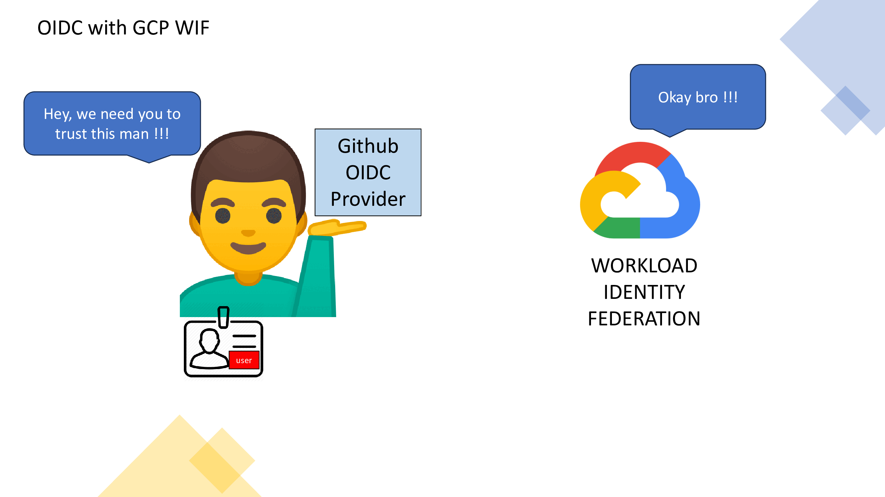

# How does the GCP Workload Identity Federation work with Github Provider ?

Traditionally, authenticating from GitHub Actions to Google Cloud required exporting and storing a **long-lived JSON service account key**, turning an identity management problem into a secrets management problem.

But now, with GitHub's introduction of [OIDC](https://github.blog/changelog/2021-10-27-github-actions-secure-cloud-deployments-with-openid-connect/) tokens into GitHub Actions Workflows, you can authenticate from GitHub Actions to Google Cloud using Workload Identity Federation, removing the need to export a long-lived JSON service account key.

## How it works ?
It's all about [service account impersonation](https://cloud.google.com/iam/docs/service-account-overview#impersonation). In short, this is a technique where a **principal** (such as a user or another service account) takes on the identity of a service account (aka [privilege-bearing service account](https://cloud.google.com/iam/docs/create-short-lived-credentials-direct#sa-impersonation)), effectively "impersonating" it. This allows the **principal** to assume the roles and permissions of the service account temporarily.

To authenticate and authorize GitHub Actions Workflows to Google Cloud via Workload Identity Federation:

In this scenario, the **Short-lived Access Token​** will have the same roles and permissions of the privilege-bearing service account (or we could say that the Github Action was **impersonate** the service account). And then the workflow Github Actions can access to the GCP target resources.

:warning: This GIF provides a simplified overview of the WIF token verification process. In reality, there are several additional services (like [STS](https://cloud.google.com/iam/docs/reference/sts/rest), etc) involved in the process !!!

In fact, GCP Workload Identity Federation works with all provider that support OpenID Connect (OIDC). 

## References
[1] https://medium.com/google-cloud/how-does-the-gcp-workload-identity-federation-work-with-github-provider-a9397efd7158

[2] https://github.blog/changelog/2021-10-27-github-actions-secure-cloud-deployments-with-openid-connect/ 

[3] https://cloud.google.com/iam/docs/create-short-lived-credentials-direct

[4] https://cloud.google.com/blog/products/identity-security/enabling-keyless-authentication-from-github-actions

